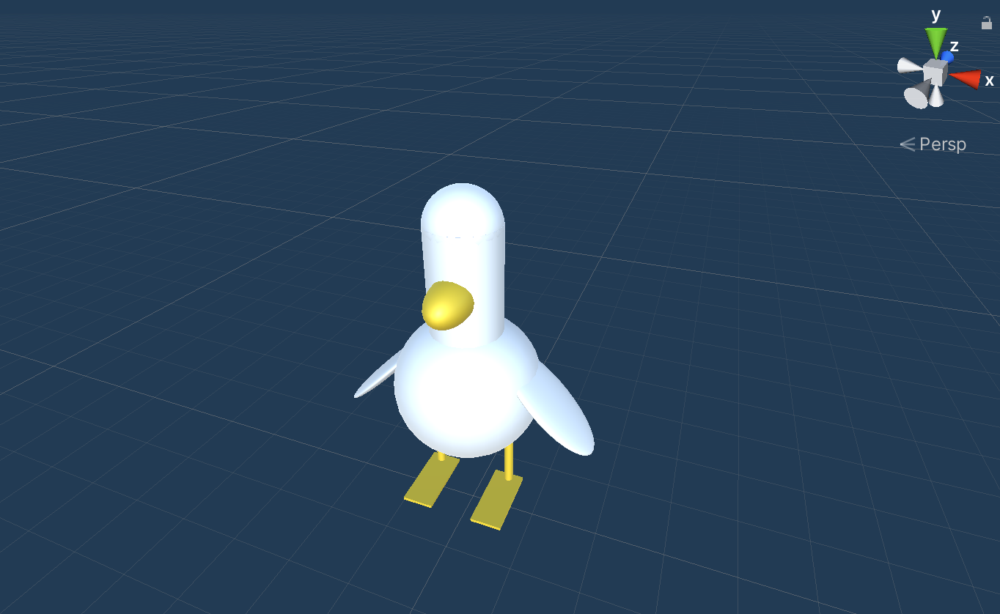

# Lucky Ducky



## Introduction 
Lucky Ducky is a 3D game inspired by the famous Flappy Bird. Play as a waggish bird trying to fly their way through obstacles to their next meal 

## How to Play 
- Press the SPACE key to keep flying 
- Press A key to move backwards 
- Press D key to move forward 

## The Code
**Note:** If you have any issues or contributions you would like to bring up, feel free to submit it **[here](https://github.com/ellojess/Lucky-Ducky/issues/new)**

If you'd like to build and view the code locally on your desktop, follow these steps: 

1. Download or clone this repo 
  ```bash
  $ git clone git@github.com:ellojess/Lucky-Ducky.git
  ```
  
2. `cd` into the project folder and open it in your chosen text editor (or use `code .` to open it in Visual Studio Code

  ```bash
  $ cd whisker-meets-js

  $ 
  ```

### Built With

* [C#](https://docs.microsoft.com/en-us/dotnet/csharp/) - Unity Scripting
* [Unity](https://unity.com/our-company) - Tech
* [Visual Studio](https://visualstudio.microsoft.com/) - IDE
